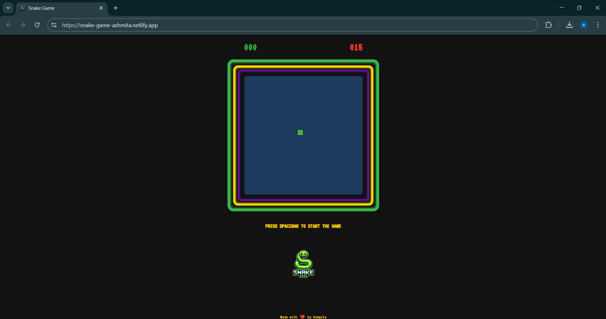

# Snake Game

A Retro Snake Game inspired by the iconic Nokia Snake game using vanilla HTML, CSS, and JavaScript.

## Features
- **Game Board**: The game board is drawn on a canvas element.
- **Snake**: The snake is created and controlled with keyboard arrow keys.
- **Food**: Food is randomly generated on the board for the snake to eat.
- **Snake Growth**: Each time the snake eats food, it grows in size.
- **Speed Increase**: The snake's speed increases over time.
- **Score Tracking**: The current score is displayed during gameplay.
- **High Score**: The high score is tracked and displayed at the end of each game.
- **Collisions**: The game checks for collisions with the snake's own body or the walls, ending the game if a collision occurs.

## Technologies Used
- **HTML**: Markup for the game structure.
- **CSS**: Styling the game elements.
- **JavaScript**: Logic for game mechanics, including snake movement, food generation, collision detection, and score tracking.

## Installation
1. Clone this repository to your local machine.
    ```bash
    git clone https://github.com/ashmita41/SnakeGame
    ```
2. Open the `index.html` file in your web browser.

## How to Play
- Use the **arrow keys** on your keyboard to control the snake.
- The goal is to eat the food that randomly appears on the game board, causing the snake to grow.
- Avoid crashing into the walls or the snake's own body.
- The game ends when a collision is detected, and your score will be shown.
- Your highest score will be saved and displayed in the game.

## Screenshot


## Contributing
Feel free to fork the repository, submit issues, or make pull requests if you want to contribute.


